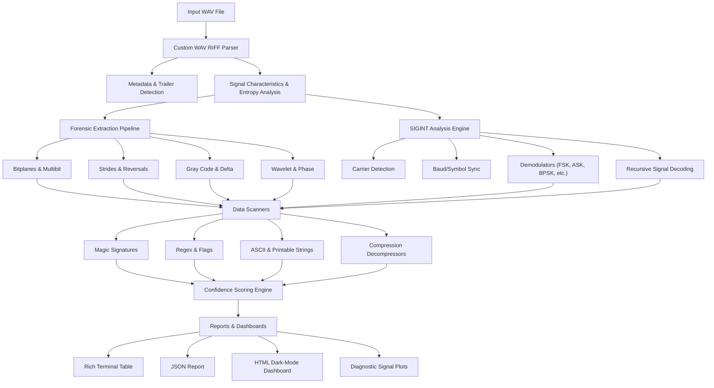

# Welcome to the WaveHunter Wiki

**WaveHunter** is an open-source Python toolkit designed for audio forensics, steganography extraction, digital signal intelligence (SIGINT), CTF challenges, malware analysis, and reverse engineering. 

Functioning as the **"Binwalk for audio"**, WaveHunter automatically parses audio streams, extracts hidden payloads across multiple domains (time, frequency, and bit-level), detects and demodulates digital carrier signals, and ranks potential data candidates using statistical confidence modeling.

---

## Technical Architecture

WaveHunter processes audio files through a modular multi-stage pipeline:

---

## Wiki Contents

Explore the details of WaveHunter's components and capabilities:

1. **[[Installation]]**: System requirements, package dependencies, and developer environment setup.
2. **[[Command-Line-Interface]]**: Reference manual for `analyze`, `extract`, `scan`, and `plot` commands with usage examples.
3. **[[Steganography-Extractors]]**: Deep dive into the physical and mathematical mechanisms behind our time and frequency domain extractors.
4. **[[Data-Scanners]]**: Explanation of signature-matching, regex scanners, character heuristics, and automatic decompression.
5. **[[SIGINT-Analysis-Engine]]**: Technical breakdown of carrier detection, digital modulation analysis, clock recovery, demodulation, and constellation plotting.
6. **[[Plugin-System]]**: How to write custom signal detectors, demodulators, decoders, and pattern scanners to extend WaveHunter.
