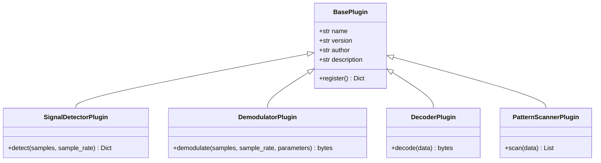

# Plugin System

WaveHunter is designed with an extensible plugin architecture, allowing developers and CTF players to write custom signal detectors, demodulators, decoders, or pattern scanners.

---

## 1. Plugin Architecture

The system discovers and registers custom plugins at startup. Any Python file placed in the `wavehunter/plugins/` directory (excluding `__init__.py`, `base.py`, and `manager.py`) is dynamically imported and scanned for classes inheriting from `BasePlugin`.

The core plugin types are defined in `wavehunter/plugins/base.py`:



---

## 2. Writing a Custom Plugin

To write a plugin, inherit from one of the plugin types and implement its required methods.

### Example 1: Custom Pattern Scanner
Suppose you want to scan for a specific, proprietary flag format (e.g. `SECRET_KEY[...]`):

```python
# Save this in wavehunter/plugins/secret_key_scanner.py
import re
from typing import List, Dict, Any
from wavehunter.plugins.base import PatternScannerPlugin

class SecretKeyScanner(PatternScannerPlugin):
    name = "Secret Key Scanner"
    version = "1.0.0"
    author = "ForensicExpert"
    description = "Scans for custom SECRET_KEY[...] patterns."

    def scan(self, data: bytes) -> List[Dict[str, Any]]:
        findings = []
        # Pattern: SECRET_KEY[A-Za-z0-9_]
        pattern = re.compile(rb'SECRET_KEY\[([A-Za-z0-9_]+)\]')
        
        for match in pattern.finditer(data):
            try:
                key_value = match.group(1).decode("utf-8")
                findings.append({
                    "offset": match.start(),
                    "type": "Secret Key",
                    "value": f"SECRET_KEY[{key_value}]",
                    "confidence": 1.0
                })
            except Exception:
                continue
                
        return findings
```

### Example 2: Custom Modulation Detector
If you have a proprietary FSK tone mapping or want to identify a new modulation:

```python
# Save this in wavehunter/plugins/proprietary_fsk_detector.py
import numpy as np
from typing import Dict, Any
from wavehunter.plugins.base import SignalDetectorPlugin

class ProprietaryFskDetector(SignalDetectorPlugin):
    name = "Proprietary FSK"
    version = "1.0.0"
    author = "ForensicExpert"
    description = "Detects 3-tone FSK carrier signals."

    def detect(self, samples: np.ndarray, sample_rate: int) -> Dict[str, Any]:
        # Custom spectral checking logic here...
        # Returns confidence between 0.0 and 1.0
        similarity = 0.85 
        
        return {
            "similarity": similarity,
            "reason": "Found 3 distinct tones spaced by 500Hz",
            "suggested_demodulator": "proprietary_fsk",
            "parameters": {
                "tones": [1000.0, 1500.0, 2000.0],
                "baud": 150.0
            }
        }
```

---

## 3. How Plugins are Loaded

The `PluginManager` class manages lifecycle events:
1. **Discovery**: Scans `wavehunter/plugins/*.py`.
2. **Dynamic Spec Import**: Imports modules using `importlib.util.spec_from_file_location`.
3. **Class Examination**: Inspects the module classes with `inspect.getmembers(module, inspect.isclass)` to find subclasses of `BasePlugin`.
4. **Registration**: Registers them into corresponding lists: `detectors`, `demodulators`, `decoders`, and `scanners`.

When the forensic pipeline runs, all registered scanners, decoders, detectors, and demodulators are executed alongside the core WaveHunter routines, integrating them into the final confidence scoring models.
