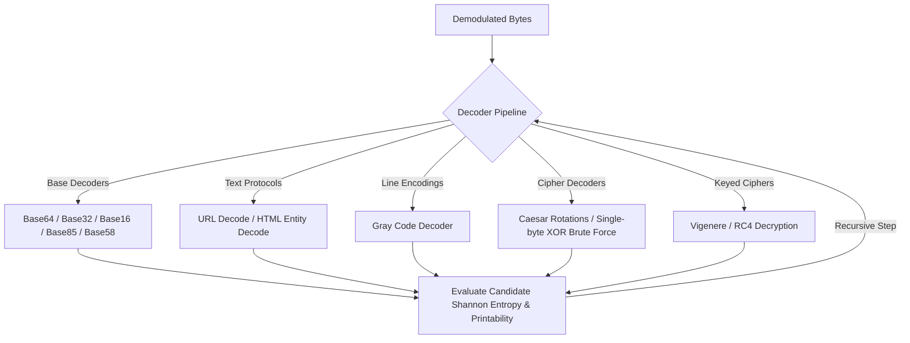

# SIGINT Analysis Engine

WaveHunter includes a professional-grade **SIGINT (Signal Intelligence) Engine** designed to discover, synchronize, demodulate, and recursively decode digital communications carrier signals modulated into audio streams. 

---

## 1. Carrier & Sweep Detection
Before demodulating a signal, WaveHunter scans the frequency spectrum using a Short-Time Fourier Transform (STFT) to isolate stable carrier frequencies and dynamic sweeps.

* **Carrier Detection**: Finds stable peaks in the signal's mean power spectrum. A peak is considered a carrier candidate if its power exceeds the median spectrum power by a threshold factor (default: $4.0$). Consistent bin energy across frames determines the carrier's **stability**.
* **Harmonic Grouping**: Group carriers that have harmonic relations (integer multiples) to help identify the fundamental carrier and sidebands.
* **Sweep Detection**: Detects linear/non-linear frequency sweeps (chirps) by tracking peak movements across time-frequency STFT frames.

---

## 2. Modulation Classification
WaveHunter scans the signal characteristics and compares them to mathematical models of known modulation techniques to classify the modulation type.

* **ASK (Amplitude Shift Keying)**: Characterized by a bimodal distribution of envelope amplitudes where signal levels alternate between distinct states.
* **FSK / AFSK (Frequency Shift Keying / Audio FSK)**: Tone-switching signaling characterized by multiple distinct, highly stable spectral peaks (mark/space tones) within the audio band.
* **BPSK (Binary Phase Shift Keying)**: Characterized by phase transitions in a single carrier frequency.
* **NRZ / Manchester**: Baseband line-coding schemes characterized by specific transition densities and clock characteristics.
* **Morse / DTMF**: Heuristics checking for standard dual-tone multi-frequency pairs or structured Morse code pauses.

---

## 3. Clock Recovery & Synchronization
To demodulate digital transitions correctly, the engine must determine the baud (symbol) rate and find the correct sampling clock phase.

* **Baud Rate Estimation**: Computes the derivative/envelope of the signal and evaluates its Fourier transform to isolate the dominant symbol rate.
* **Symbol Synchronization**: Implements clock recovery algorithms (like the early-late gate synchronizer) to align the sampling window boundaries with incoming symbol transitions.

---

## 4. Demodulators
Once parameters are locked, WaveHunter routes the samples to a dedicated demodulator:

* **FSK Demodulator**: Compares DFT/Goertzel filter energy at the mark and space frequencies over each symbol period to yield a bitstream.
* **ASK Demodulator**: Applique clock recovery and thresholds the amplitude envelope against the mean envelope level.
* **BPSK Demodulator**: Computes the carrier's phase angle $\theta = \angle X(f_c)$ for each symbol and applies differential decoding:
  $$\Delta \theta = \theta[n] - \theta[n-1]$$
  If $|\Delta \theta| > \pi/2$, it outputs a `1`, otherwise `0`.
* **Morse & DTMF Decoders**: Parse sequences of tones and silences, mapping DTMF grid pairs (e.g. 941 Hz + 1336 Hz = `#`) and Morse intervals directly to ASCII.

---

## 5. Recursive Decoding Pipeline
Demodulated bitstreams are passed to a recursive decoder that attempts up to 3+ layers of nesting:

* **XOR & Keyed Cryptanalysis**: The pipeline automatically runs brute-force single-byte XOR scans and tests multi-byte XOR (Vigenere) and RC4 using common repository keys (e.g. `EDEN-1499`, `sparrows`, `animus`, `abstergo`).

---

## 6. Constellation Plotting
Using the `plot` command, you can generate IQ constellation diagrams:
* The signal is mixed with complex carrier references: $s_{I}[t] = s[t] \cos(2\pi f_c t)$ and $s_{Q}[t] = -s[t] \sin(2\pi f_c t)$.
* Lowpass filtered to isolate the baseband.
* Sampled at the recovered symbol clock points.
* Plotted in the complex plane ($I$ vs. $Q$) to visually confirm carrier phases (e.g. two distinct clusters for BPSK).
